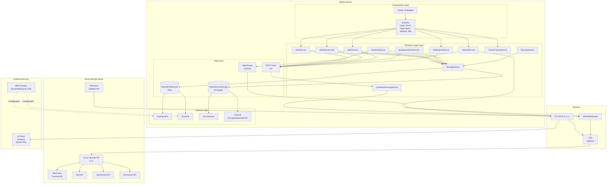
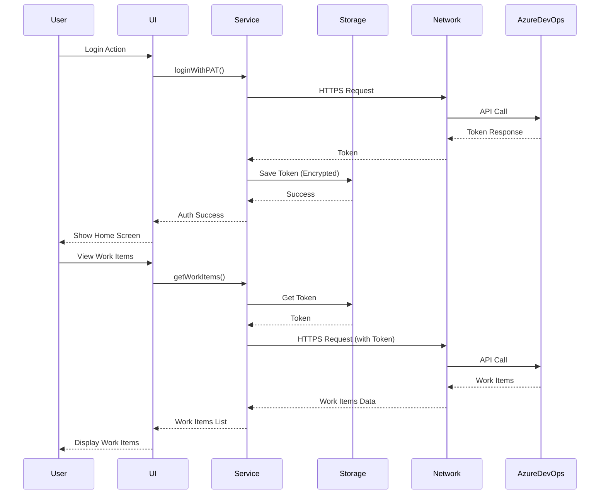
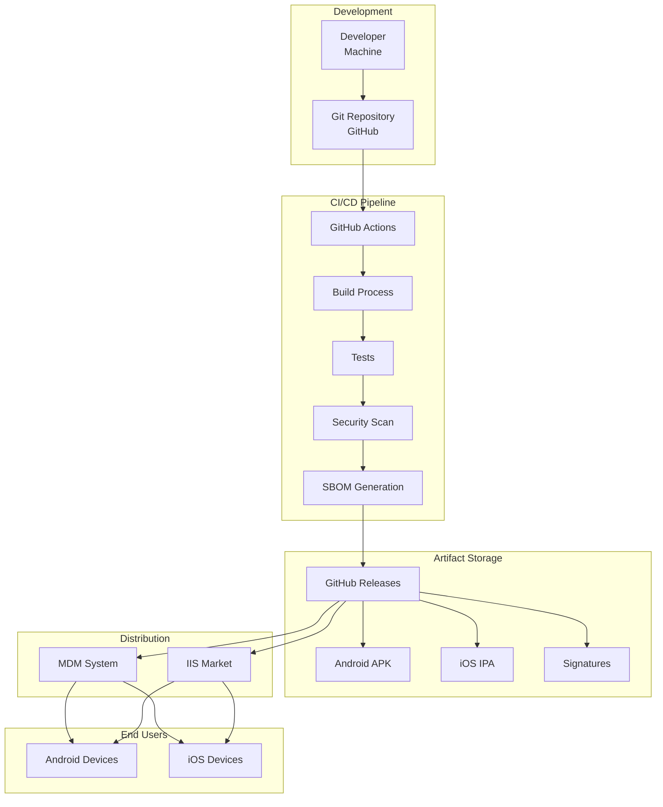

# Mimari Topoloji Dokümantasyonu

**Uygulama:** Azure DevOps Server 2022 Mobile App  
**Geliştirici:** Alpay Bilgiç  
**Versiyon:** 1.2.0+46  
**Tarih:** 2025-01-21

## Genel Bakış

Bu dokümantasyon, Azure DevOps Server 2022 Mobile App'in mimari topolojisini, bileşenlerini ve bunlar arasındaki ilişkileri açıklar.

## Mimari Katmanlar

### 1. Presentation Layer (UI Layer)
- **Flutter Widgets**: Tüm kullanıcı arayüzü bileşenleri
- **Screens**: Login, Home, Work Item Detail, Settings, Wiki, Market, Documents
- **State Management**: Provider pattern

### 2. Business Logic Layer
- **Services**: İş mantığı ve API iletişimi
- **State Management**: Provider ile state yönetimi

### 3. Data Layer
- **Local Storage**: SharedPreferences, FlutterSecureStorage
- **Network**: HTTP/HTTPS API çağrıları
- **Real-time**: WebSocket bağlantıları

### 4. Platform Layer
- **Android**: Native Android APIs
- **iOS**: Native iOS APIs
- **Security**: Certificate Pinning, Root/Jailbreak Detection

## Mimari Topoloji Diyagramı

## Detaylı Bileşen Mimarisi

### Service Layer Detayları

```mermaid
graph LR
    subgraph "Service Layer"
        AUTH_SVC[AuthService<br/>- PAT Authentication<br/>- AD Authentication<br/>- Token Management]
        STORAGE_SVC[StorageService<br/>- Secure Storage<br/>- Preferences<br/>- Settings]
        WORKITEM_SVC[WorkItemService<br/>- CRUD Operations<br/>- Custom Fields<br/>- Attachments<br/>- Comments]
        WIKI_SVC[WikiService<br/>- Wiki Content<br/>- Markdown Rendering]
        NOTIF_SVC[NotificationService<br/>- Local Notifications<br/>- Push Notifications]
        BG_SVC[BackgroundTaskService<br/>- Periodic Checks<br/>- Notification Filtering]
        REALTIME_SVC[RealtimeService<br/>- WebSocket Connection<br/>- Real-time Updates]
        MARKET_SVC[MarketService<br/>- File Listing<br/>- File Download]
        TURKISH_SVC[TurkishCultureService<br/>- Random Info<br/>- Culture Data]
        SECURITY_SVC[SecurityService<br/>- Root Detection<br/>- Security Logging]
        CERT_SVC[CertificatePinningService<br/>- SHA-256 Pinning<br/>- Certificate Validation]
    end
```

### Data Flow Diyagramı

### Security Architecture

```mermaid
graph TB
    subgraph "Security Layers"
        APP_SEC[Application Security]
        NET_SEC[Network Security]
        DATA_SEC[Data Security]
        DEV_SEC[Device Security]
    end
    
    subgraph "Application Security"
        CERT_PIN[Certificate Pinning<br/>SHA-256]
        ROOT_DET[Root/Jailbreak<br/>Detection]
        SEC_LOG[Security Logging]
        AUTO_LOGOUT[Auto Logout<br/>30 days]
    end
    
    subgraph "Network Security"
        HTTPS_ONLY[HTTPS Only<br/>TLS 1.2+]
        CERT_VALID[Certificate<br/>Validation]
        VPN_SUPPORT[VPN Support]
    end
    
    subgraph "Data Security"
        ENCRYPT_STOR[Encrypted Storage<br/>AES-256]
        SECURE_TOKEN[Secure Token<br/>Storage]
        NO_PLAIN[No Plain Text<br/>Credentials]
    end
    
    subgraph "Device Security"
        MDM_INT[MDM Integration]
        REMOTE_WIPE[Remote Wipe]
        DEVICE_ENCRYPT[Device Encryption<br/>Required]
    end
    
    APP_SEC --> CERT_PIN
    APP_SEC --> ROOT_DET
    APP_SEC --> SEC_LOG
    APP_SEC --> AUTO_LOGOUT
    
    NET_SEC --> HTTPS_ONLY
    NET_SEC --> CERT_VALID
    NET_SEC --> VPN_SUPPORT
    
    DATA_SEC --> ENCRYPT_STOR
    DATA_SEC --> SECURE_TOKEN
    DATA_SEC --> NO_PLAIN
    
    DEV_SEC --> MDM_INT
    DEV_SEC --> REMOTE_WIPE
    DEV_SEC --> DEVICE_ENCRYPT
```

## Bileşen Açıklamaları

### Presentation Layer

#### Screens
- **LoginScreen**: Kullanıcı kimlik doğrulama
- **HomeScreen**: Ana dashboard, work items listesi, wiki özeti, Türk kültürü popup
- **WorkItemDetailScreen**: Work item detayları, custom fields, attachments, comments
- **WorkItemListScreen**: Work items listesi ve filtreleme
- **QueriesScreen**: Query çalıştırma ve sonuç görüntüleme
- **WikiViewerScreen**: Wiki içerik görüntüleme
- **SettingsScreen**: Uygulama ayarları, bildirim ayarları
- **MarketScreen**: APK/IPA dosyalarını indirme
- **DocumentsScreen**: Dokümantasyon görüntüleme

### Business Logic Layer

#### Services

**AuthService**
- PAT ve AD kimlik doğrulama
- Token yönetimi
- Oturum yönetimi
- Logout işlemleri

**StorageService**
- Güvenli veri saklama (FlutterSecureStorage)
- Genel ayarlar (SharedPreferences)
- Token ve kimlik bilgileri yönetimi
- Bildirim ayarları yönetimi
- Akıllı saat bildirim ayarları
- Nöbetçi modu ayarları (telefon ve akıllı saat için ayrı)
- Tatil modu ayarları (telefon ve akıllı saat için ayrı)
- Okunmayan bildirim retry takibi

**WorkItemService**
- Work item CRUD işlemleri
- Custom field yönetimi
- Attachment yükleme ve görüntüleme
- Comments/Discussion yönetimi
- Field definition'ları alma

**WikiService**
- Wiki içerik çekme
- Markdown rendering

**NotificationService**
- Local notification gönderme
- Bildirim ayarlarına göre filtreleme
- Akıllı saat bildirimleri (Wear OS ve watchOS)
- Etkileşimli butonlar ile state değiştirme
- Nöbetçi modu için agresif bildirimler
- Tatil modu kontrolü

**BackgroundTaskService**
- Periyodik work item kontrolü
- Bildirim gönderme
- Bildirim filtreleme mantığı
- Nöbetçi modu kontrolü
- Tatil modu kontrolü
- Okunmayan bildirimleri 3 kez yenileme (nöbetçi modunda)

**RealtimeService**
- WebSocket bağlantısı
- Gerçek zamanlı güncellemeler
- Bildirim gönderme
- Nöbetçi modu kontrolü
- Tatil modu kontrolü

**MarketService**
- IIS static dizin listeleme
- APK/IPA dosyalarını indirme

**TurkishCultureService**
- Rastgele Türk kültürü bilgileri
- Tarihi figürler ve devletler

**SecurityService**
- Root/jailbreak tespiti
- Güvenlik loglama

**CertificatePinningService**
- SHA-256 certificate pinning
- Certificate validation

### Data Layer

#### Storage
- **FlutterSecureStorage**: Şifrelenmiş veri saklama (token'lar, kimlik bilgileri)
- **SharedPreferences**: Genel ayarlar (server URL, collection, vb.)

#### Network
- **Dio**: HTTP client (HTTPS istekleri)
- **WebSocket Channel**: Gerçek zamanlı güncellemeler

### Platform Layer

#### Android
- EncryptedSharedPreferences (FlutterSecureStorage)
- Android Auto Backup
- Root detection

#### iOS
- Keychain Services (FlutterSecureStorage)
- iCloud Backup
- Jailbreak detection

## Veri Akışı

### Authentication Flow
1. Kullanıcı kimlik bilgilerini girer
2. AuthService API'ye istek gönderir
3. Token alınır ve FlutterSecureStorage'da saklanır
4. Token tüm API isteklerinde kullanılır

### Work Item Flow
1. Kullanıcı work item listesini görüntüler
2. WorkItemService API'den work item'ları çeker
3. Custom field definition'ları alınır
4. Veriler UI'da gösterilir
5. Kullanıcı değişiklik yaparsa API'ye gönderilir

### Notification Flow
1. BackgroundTaskService periyodik olarak çalışır
2. Yeni/ güncellenmiş work item'lar kontrol edilir
3. Bildirim ayarlarına göre filtreleme yapılır:
   - İlk atamada bildirim kontrolü
   - Tüm güncellemelerde bildirim kontrolü
   - Hotfix filtresi
   - Grup bildirimleri
   - Nöbetçi modu kontrolü (telefon ve akıllı saat için ayrı)
   - Tatil modu kontrolü (telefon ve akıllı saat için ayrı)
4. Uygun bildirimler gönderilir:
   - Telefon bildirimleri (normal veya nöbetçi modu)
   - Akıllı saat bildirimleri (sadece ilk atamada, etkileşimli butonlarla)
5. Nöbetçi modunda okunmayan bildirimler 3 kez yenilenir (30 saniye aralıklarla)

### Real-time Update Flow
1. RealtimeService WebSocket bağlantısı kurar
2. Azure DevOps Server'dan güncellemeler alınır
3. Bildirim ayarlarına göre filtreleme yapılır:
   - İlk atamada bildirim kontrolü
   - Tüm güncellemelerde bildirim kontrolü
   - Hotfix filtresi
   - Grup bildirimleri
   - Nöbetçi modu kontrolü (telefon ve akıllı saat için ayrı)
   - Tatil modu kontrolü (telefon ve akıllı saat için ayrı)
4. UI güncellenir ve bildirimler gönderilir:
   - Telefon bildirimleri (normal veya nöbetçi modu)
   - Akıllı saat bildirimleri (sadece ilk atamada, etkileşimli butonlarla)

## Güvenlik Mimarisi

### Katmanlar
1. **Application Layer**: Certificate pinning, root detection
2. **Network Layer**: HTTPS/TLS, VPN support
3. **Data Layer**: Encrypted storage, secure token management
4. **Device Layer**: MDM integration, device encryption

### Güvenlik Özellikleri
- ✅ Certificate Pinning (SHA-256)
- ✅ Encrypted Storage (AES-256)
- ✅ Root/Jailbreak Detection
- ✅ Security Logging
- ✅ Auto Logout (30 days)
- ✅ MDM Integration
- ✅ Remote Wipe Support

## Deployment Topology

## Teknoloji Stack

### Frontend
- **Framework**: Flutter 3.24.0
- **Language**: Dart
- **State Management**: Provider
- **UI Components**: Material Design, Cupertino

### Backend Integration
- **API**: Azure DevOps Server REST API v7.0
- **Protocol**: HTTPS/TLS 1.2+
- **Real-time**: WebSocket (WSS)

### Storage
- **Secure**: FlutterSecureStorage (AES-256)
- **General**: SharedPreferences

### Security
- **Certificate Pinning**: SHA-256 fingerprints
- **Encryption**: AES-256
- **Root Detection**: root_detector package

### Platform
- **Android**: Minimum SDK 21, Target SDK 34
- **iOS**: Minimum iOS 12.0, Target iOS 17.0

## İlgili Dokümantasyon

- **Güvenlik**: [docs/SECURITY.md](SECURITY.md)
- **Altyapı**: [docs/INFRASTRUCTURE.md](INFRASTRUCTURE.md)
- **MDM Entegrasyonu**: [docs/MDM_INTEGRATION.md](MDM_INTEGRATION.md)
- **Güvenlik Özellikleri**: [docs/SECURITY_FEATURES.md](SECURITY_FEATURES.md)

---

**Son Güncelleme:** 2025-01-21  
**Dokümantasyon Versiyonu:** 1.2.0

